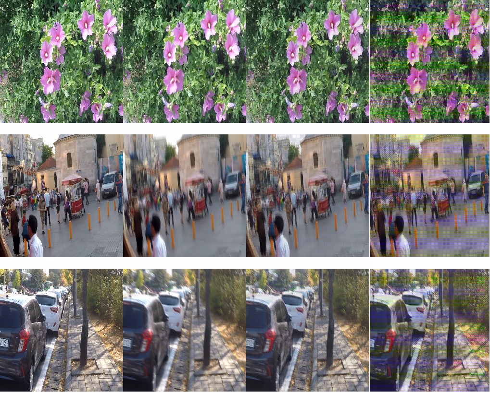
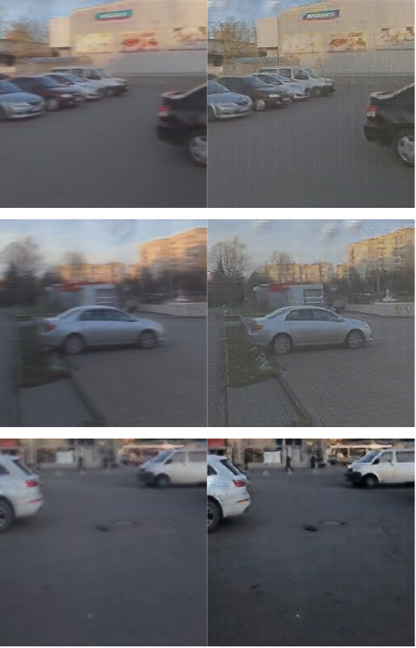
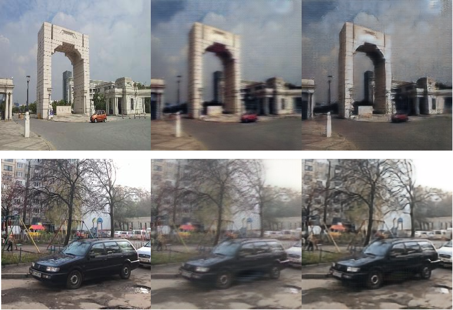
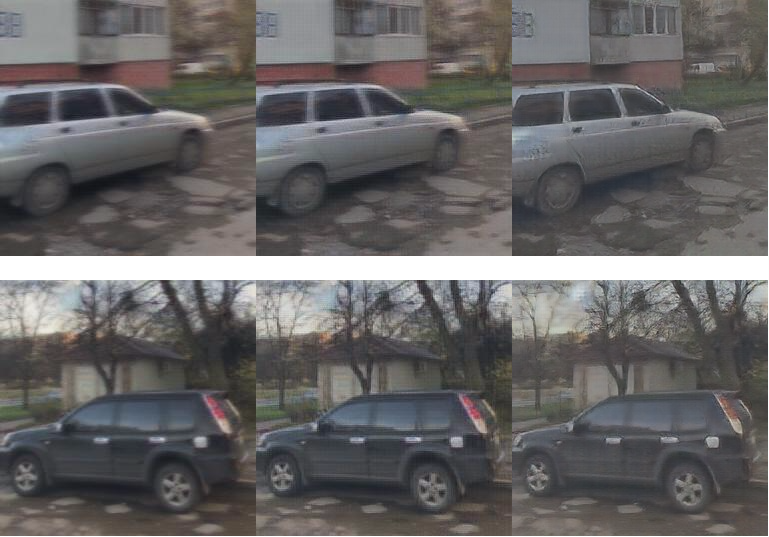
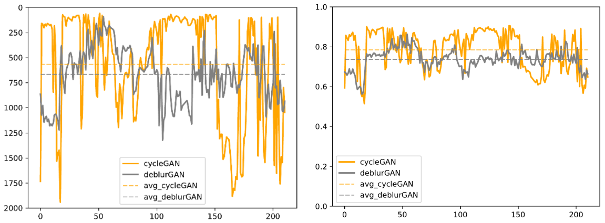

# VRAR-Course-Project
- This project was motivated by [DeblurGAN](https://github.com/KupynOrest/DeblurGAN) and [CycleGAN](https://github.com/vanhuyz/CycleGAN-TensorFlow).

- CycleGAN Original paper: https://arxiv.org/abs/1703.10593

- DeblurGAN Original paper: https://arxiv.org/pdf/1711.07064.pdf

Our idea is that if we can
treat blur and sharpness as a kind of image style, successful
image deblurring may be achieved with unpaired image dataset
based on CycleGAN. And the outcome indeed proves that
CycleGAN can achieve similar result to that of DeblurGAN
if we properly select the training dataset.

# Requirements
- [TensorFlow](https://www.tensorflow.org/)
- [Keras](https://pypi.org/project/Keras/)

# DeblurGAN
## Installation

```
virtualenv venv -p python3
. venv/bin/activate
pip install -r requirements.txt
```
## Dataset

Get the [GOPRO dataset](https://drive.google.com/file/d/1H0PIXvJH4c40pk7ou6nAwoxuR4Qh_Sa2/view?usp=sharing), and extract it in the `deblur-gan` directory. The directory name should be `GOPRO_Large`.


Use:
```
python organize_gopro_dataset.py --dir_in=GOPRO_Large --dir_out=images
```


## Training

```
python train.py --n_images=512 --batch_size=16 --epoch_num=50
```

Use `python train.py --help` for all options

## Testing

```
python test.py
```

Use `python test.py --help` for all options

## Deblur your own image

```
python deblur_image.py --image_path=path/to/image
```
## Pretrained Model
The [model](https://github.com/QLightman/VRAR-Course-Project/blob/master/DeblurGAN/generator_49_478.h5) was trained using two Titan XP Gpus for 50 epochs.

# CycleGAN
## Dataset
The dataset we use are in the **CycleGAN_Data** folder.

* Write the dataset to tfrecords
```bash
$ python build_data.py --X_input_dir  CycleGAN_dataset/trainA \
	               --Y_input_dir CycleGAN_dataset/trainB \
	--X_output_file data/CycleGAN_dataset/blurred.tfrecords \
        --Y_output_file data/CycleGAN_dataset/sharp.tfrecords
```

## Training

```bash
$ python train.py --X data/CycleGAN_dataset/blurred.tfrecords \
		   --Y data/CycleGAN_dataset/sharp.tfrecords \
				   --skip False
```

To change other default settings, you can check [train.py](https://github.com/QLightman/VRAR-Course-Project/blob/master/%20CycleGAN_Code/train.py)


## Check TensorBoard to see training progress and generated images.
```
$ tensorboard --logdir checkpoints/${datetime}
```

## Export model
You can export from a checkpoint to a standalone GraphDef file as follow:

```bash
$ python export_graph.py --checkpoint_dir checkpoints/${datetime} \
                          --XtoY_model blurred2sharp.pb \
                          --YtoX_model sharp2blurred.pb \
                          --image_size 256
```

## Inference
After exporting model, you can use it for inference. For example:
```bash
python inference.py --model model/blurred2sharp.pb \
                     --input input_sample.jpg \
                     --output output_sample.jpg \
                     --image_size 256
```
More sample inference code are given in 'trans.txt' 

## Pretrained Models
Our pretrained models are in the **CycleGAN_Model** folder. 


# Results 

- Images processed by DeblurGAN . From left to right: ground truth sharp image, blurred photo, result of DeblurGAN
obtained by us, result of DeblurGAN presented in the [paper](https://arxiv.org/pdf/1711.07064.pdf).

<figure class="half">
    
</figure>

- Images processed by CycleGAN . From left to right:
blurred photo, result of CycleGAN .
<figure class="half">
    
</figure>

- Images processed by CycleGAN . From left to right:
A(ground truth sharp image), B(A blurred by CycleGAN ),
C(B deblurred by CycleGAN ).
<figure class="half">
    
</figure>

- Results of image deblurring with DeblurGAN and
CycleGAN . From left to right: blurred photo, result of
DeblurGAN , result of CycleGAN .

<figure class="half">
    
</figure>

## Comparison  
- Data used in comparison part are stored in **Comparison** floder.
- Two metrics are introduced to measure the similarity.
One is Mean Squre Error (MSE) and the other is Structural Similarity Index[3] (SSIM). 
- From left to right: Result with MSE measurement. 
Result with SSIM measurement.

<figure class="half">
    
</figure>


- According to SSIM, about 69% out of all test images using CycleGAN outperforms that using DeblurGAN . And from the table, in a general sense, the result of CycleGAN is better than that of DeblurGAN because of a higher
SSIM and lower MSE. Thus we can draw the conclusion
that CycleGAN can achieve better visual result compared
with DeblurGAN . And in most of the cases, CycleGAN
outperforms DeblurGAN in image deblurring.


| Metric | DeblurGAN | CycleGAN (ours) |
| :---- |:------------:|:------------: |
| SSIM |  0.737 |　0.784　 |
| MSE | 667.3　| 667.3　 |


# Team Members
- [Zhiwen Qiang](https://github.com/QLightman)

- [Hao Wang](https://github.com/wrystal)

